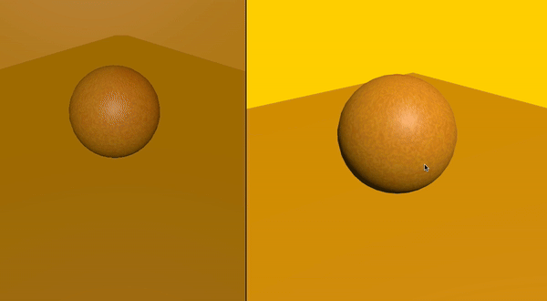
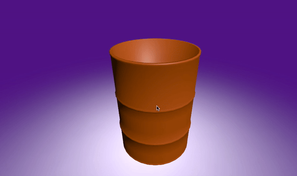

# Unity 3D Mesh Slicer/Mesh Cutter
 
 This Unity 3D Mesh Slicer is a simple and easy-to-use tool for cutting and deforming 3D meshes. It works with any Unity version and doesn't rely on specific rendering settings, making it versatile for various projects. This tool is also optimized for mobile use, making it a great choice for applications on both mobile and desktop platforms. With its straightforward setup, anyone can add mesh slicing functionality to their game or app without hassle.

---
**Basic Example**:  
 
 

 **Working with Texture**:  
 

 **Complex Mesh**:  
 
---

### System Design

The system starts with the **MHCutter** component, which manages the process of cutting and dividing meshes:

1. **Creating an Infinity Plane**:  
   The process begins by creating a Unity Infinity Plane at the targeted cutting position. This plane acts as the slicing reference for the mesh. You can define you own plane as per game demand.

2. **Dividing the Target Object**:  
   The targeted GameObject's mesh is split into two parts based on its triangle data. This is where **MHMesh** comes in—it stores the information of these triangles.

3. **Finding and Modifying Triangles**:  
   All divided triangles are processed, and two new points are added to the edges of each intersected triangle. This step ensures accurate slicing across the mesh.

4. **Generating New Triangles**:  
   Using the newly added points, the system generates three additional triangles. These triangles are then saved in their respective **left** and **right** `MHMesh` instances.

5. **Filling the Mesh**:  
   After the mesh is divided, the system traverses all newly created vertices along the cut edge. If the edge forms a connected shape, the system ensures that it fills the loop correctly.

6. **Fixing UVs**:  
   Once the new geometry is generated, the UVs of the newly created areas are adjusted to ensure that the texture mapping remains seamless and correct.

 > I use unity MonoBehaviour so that you can easily observe all changes in Unity Scene Inspector.
---
 
👉 You can use this repository in your own projects or packages.

🔗 You can find me on LinkedIn [💼]([LinkedIn Profile Link](https://www.linkedin.com/in/marufhow/)).

⭐ Don’t forget to give this repository **a star on GitHub** if you find it useful! 🌟

---